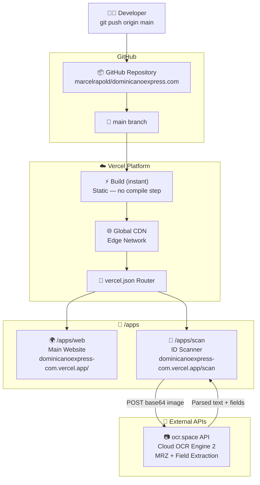

# dominicanoexpress.com

[](https://dominicanoexpress-com.vercel.app)
[](https://github.com/marcelrapold/dominicanoexpress.com)
[](https://ocr.space)
[](LICENSE)
[]()

> Monorepo for **dominicanoexpress.com** — main website + AI-powered ID Scanner app.  
> Zero-build · Pure HTML/CSS/JS · Deployed via Vercel on every push to `main`.

---

## Table of Contents

- [Architecture](#architecture)
- [Repository Structure](#repository-structure)
- [Apps](#apps)
- [Tech Stack](#tech-stack)
- [Deployment](#deployment)
- [Local Development](#local-development)
- [Environment Variables](#environment-variables)
- [Routing](#routing)

---

## Architecture



---

## Repository Structure

```
dominicanoexpress.com/
│
├── apps/
│   ├── scan/                   # ID Scanner App
│   │   └── index.html          #   Single-file app (OCR + UI)
│   │
│   └── web/                    # Main Website
│       └── index.html          #   Placeholder (content coming soon)
│
├── .gitignore
├── vercel.json                 # Routing + Security Headers
└── README.md
```

---

## Apps

### 🪪 `/apps/scan` — ID Scanner

**URL:** [`/scan`](https://dominicanoexpress-com.vercel.app/scan)

AI-powered document recognition for ID cards, passports, and driver's licenses.  
Extracts all fields including the MRZ zone, structures them, and provides copy-to-clipboard export.

**Features:**
| Feature | Detail |
|---|---|
| Document Types | National ID (TD1) · Passport (TD3) · Driver's License · Visa |
| Input | Live camera · Upload photo · Drag & Drop |
| OCR Engine | OCR.space API Engine 2 (cloud-based, no WASM) |
| MRZ Parser | TD1 (30×3) + TD3 (44×2) fully supported |
| Extracted Fields | Name · Date of Birth · Document No. · Expiry · Nationality · Sex · Height · Place of Origin · Authority · Date of Issue |
| Auto-Capture | Laplacian sharpness detection — captures automatically when image is in focus |
| Haptic Feedback | Native vibration patterns on Android (soft tap, success, error) |
| Export | Structured plaintext · Copy per field · Copy All |
| iOS / Android | ✅ Fully compatible (no WASM dependency) |
| Privacy | Images sent once to ocr.space for processing, not stored |

---

### 🌍 `/apps/web` — Main Website

**URL:** [`/`](https://dominicanoexpress-com.vercel.app)

Main website for dominicanoexpress.com.  
Content to be delivered separately. Placeholder currently active.

---

## Tech Stack

| Layer | Technology | Rationale |
|---|---|---|
| **Frontend** | Vanilla HTML / CSS / JS | Zero dependencies, maximum compatibility |
| **OCR** | [ocr.space API](https://ocr.space/ocrapi) | Cloud OCR, no WASM, iOS-compatible, free tier |
| **Hosting** | [Vercel](https://vercel.com) | Edge CDN, GitHub integration, SSL, free tier |
| **Routing** | `vercel.json` rewrites | Map monorepo paths to URL paths |
| **CI/CD** | GitHub (implicit via Vercel) | Push to `main` → auto-deploy in ~10s |
| **MRZ Parsing** | Custom JS parser | TD1 + TD3, no external package needed |
| **Sharpness Detection** | Laplacian variance (canvas) | Real-time focus analysis for auto-capture |

---

## Deployment

### Automatic (recommended)

Every push to `main` triggers an automatic production deployment:

```bash
git add .
git commit -m "feat: describe your change"
git push origin main
# → Vercel deploys automatically within ~10s
```

### Manual via Vercel CLI

```bash
# Install CLI (once)
npm i -g vercel

# Login (once)
vercel login

# Link project (once)
vercel link --project dominicanoexpress-com

# Deploy to production
vercel --prod --yes
```

### Check deployment status

```bash
vercel inspect dominicanoexpress-com.vercel.app
```

Or via dashboard: [vercel.com/muraschal/dominicanoexpress-com](https://vercel.com/muraschal/dominicanoexpress-com)

---

## Local Development

Since the apps are pure HTML, a simple HTTP server is sufficient:

```bash
# Option A: Python (no install required)
python -m http.server 3000
# → http://localhost:3000/apps/scan/

# Option B: Node.js via npx
npx serve .
# → http://localhost:3000

# Option C: Vercel Dev (full routing from vercel.json)
npm i -g vercel
vercel dev
# → http://localhost:3000/scan   (routing identical to production)
```

> ⚠️ **Camera & HTTPS:** Camera access requires HTTPS or `localhost`.  
> Both `vercel dev` and `python -m http.server` work on `localhost`.

---

## Environment Variables

No server-side environment variables required.  
The OCR API key is configured client-side in `apps/scan/index.html`:

| Variable | File | Default | Description |
|---|---|---|---|
| `OCR_KEY` | `apps/scan/index.html` (JS) | `helloworld` | OCR.space API key |

> **Production recommendation:** Register your own free key at [ocr.space/ocrapi](https://ocr.space/ocrapi) (25,000 req/month free) and replace it in the file. Alternatively, protect it via a Vercel Serverless Function proxy.

---

## Routing

Configured in [`vercel.json`](./vercel.json):

| URL | File | Description |
|---|---|---|
| `/` | `apps/web/index.html` | Main website |
| `/*` | `apps/web/*` | All web sub-pages |
| `/scan` | `apps/scan/index.html` | ID Scanner app |
| `/scan/*` | `apps/scan/*` | Scanner assets |

Security headers applied to all routes (`X-Frame-Options`, `X-Content-Type-Options`, `X-XSS-Protection`).

---

## Adding a New App

```bash
# 1. Create directory
mkdir apps/my-app

# 2. Build your app
echo "<h1>Hello</h1>" > apps/my-app/index.html

# 3. Add route in vercel.json
# { "source": "/my-app", "destination": "/apps/my-app/index.html" }

# 4. Deploy
git add .
git commit -m "feat: add my-app"
git push
```

---

## URLs

| Environment | URL |
|---|---|
| Production (Web) | https://dominicanoexpress-com.vercel.app |
| Production (Scan) | https://dominicanoexpress-com.vercel.app/scan |
| GitHub | https://github.com/marcelrapold/dominicanoexpress.com |
| Vercel Dashboard | https://vercel.com/muraschal/dominicanoexpress-com |

---

*Static Monorepo · Deployed on Vercel · MIT License*
