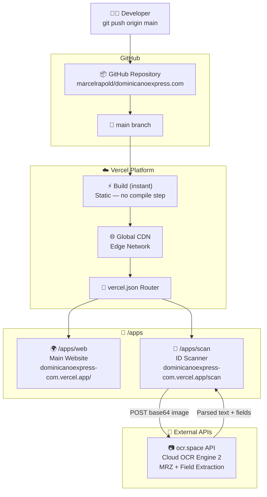

# dominicanoexpress.com

[](https://dominicanoexpress-com.vercel.app)
[](https://github.com/marcelrapold/dominicanoexpress.com)
[](https://ocr.space)
[](LICENSE)
[]()

> Monorepo für **dominicanoexpress.com** — Hauptwebsite + AI-gestützte ID-Scanner App.  
> Zero-Build · Pure HTML/CSS/JS · Deployed via Vercel on every push to `main`.

---

## Inhaltsverzeichnis

- [Architektur](#architektur)
- [Repository-Struktur](#repository-struktur)
- [Apps](#apps)
- [Tech Stack](#tech-stack)
- [Deployment](#deployment)
- [Lokale Entwicklung](#lokale-entwicklung)
- [Umgebungsvariablen](#umgebungsvariablen)
- [Routing](#routing)

---

## Architektur



---

## Repository-Struktur

```
dominicanoexpress.com/
│
├── apps/
│   ├── scan/                   # ID Scanner App
│   │   └── index.html          #   Single-file app (OCR + UI)
│   │
│   └── web/                    # Hauptwebsite
│       └── index.html          #   Placeholder (Inhalt folgt)
│
├── .gitignore
├── vercel.json                 # Routing + Security Headers
└── README.md
```

---

## Apps

### 🪪 `/apps/scan` — ID Scanner

**URL:** [`/scan`](https://dominicanoexpress-com.vercel.app/scan)

KI-gestützte Dokumentenerkennung für Ausweise, Reisepässe und Führerscheine.  
Extrahiert alle Felder inklusive MRZ-Zone, strukturiert sie und ermöglicht Copy-to-Clipboard Export.

**Features:**
| Feature | Detail |
|---|---|
| Dokumenttypen | Personalausweis (TD1) · Reisepass (TD3) · Führerschein · Visum |
| Eingabe | Live-Kamera · Foto hochladen · Drag & Drop |
| OCR Engine | OCR.space API Engine 2 (Cloud, kein WASM) |
| MRZ Parser | TD1 (30×3) + TD3 (44×2) vollständig |
| Extrahierte Felder | Name · Geburtsdatum · Dokumentnummer · Gültigkeit · Nationalität · Geschlecht · Grösse · Heimatort · Behörde · Ausstellungsdatum |
| Export | Plaintext strukturiert · Copy per Feld · Copy All |
| iOS / Android | ✅ Vollständig kompatibel (kein WASM) |
| Datenschutz | Bilder werden einmalig an ocr.space gesendet, nicht gespeichert |

---

### 🌍 `/apps/web` — Hauptwebsite

**URL:** [`/`](https://dominicanoexpress-com.vercel.app)

Hauptwebsite für dominicanoexpress.com.  
Inhalt wird separat geliefert. Placeholder aktiv.

---

## Tech Stack

| Schicht | Technologie | Begründung |
|---|---|---|
| **Frontend** | Vanilla HTML / CSS / JS | Zero-dependency, maximale Kompatibilität |
| **OCR** | [ocr.space API](https://ocr.space/ocrapi) | Cloud-OCR, kein WASM, iOS-kompatibel, kostenlose Tier |
| **Hosting** | [Vercel](https://vercel.com) | Edge CDN, GitHub-Integration, SSL, Free Tier |
| **Routing** | `vercel.json` Rewrites | Monorepo-Pfade auf URL-Pfade mappen |
| **CI/CD** | GitHub Actions (implicit via Vercel) | Push to `main` → auto-deploy |
| **MRZ Parsing** | Custom JS Parser | TD1 + TD3, kein externes Package nötig |

---

## Deployment

### Automatisch (empfohlen)

Jeder Push auf `main` löst automatisch ein Production-Deployment aus:

```bash
git add .
git commit -m "feat: beschreibung"
git push origin main
# → Vercel deployt automatisch innerhalb ~10s
```

### Manuell via Vercel CLI

```bash
# CLI installieren (einmalig)
npm i -g vercel

# Login (einmalig)
vercel login

# Projekt verknüpfen (einmalig)
vercel link --project dominicanoexpress-com

# Production deploy
vercel --prod --yes
```

### Deployment-Status prüfen

```bash
vercel inspect dominicanoexpress-com.vercel.app
```

Oder im Dashboard: [vercel.com/muraschal/dominicanoexpress-com](https://vercel.com/muraschal/dominicanoexpress-com)

---

## Lokale Entwicklung

Da die Apps reines HTML sind, reicht ein einfacher HTTP-Server:

```bash
# Option A: Python (kein Install nötig)
python -m http.server 3000
# → http://localhost:3000/apps/scan/

# Option B: Node.js npx
npx serve .
# → http://localhost:3000

# Option C: Vercel Dev (mit vollem Routing aus vercel.json)
npm i -g vercel
vercel dev
# → http://localhost:3000/scan   (Routing identisch zu Production)
```

> ⚠️ **Kamera & HTTPS:** Kamerazugriff erfordert HTTPS oder `localhost`.  
> `vercel dev` und `python -m http.server` auf `localhost` funktionieren beide.

---

## Umgebungsvariablen

Aktuell keine serverseitigen Umgebungsvariablen nötig.  
Der OCR API-Key ist clientseitig in `apps/scan/index.html` konfiguriert:

| Variable | Datei | Default | Beschreibung |
|---|---|---|---|
| `OCR_KEY` | `apps/scan/index.html` (JS) | `helloworld` | OCR.space API Key |

> **Produktionsempfehlung:** Eigenen kostenlosen Key auf [ocr.space/ocrapi](https://ocr.space/ocrapi) registrieren (25.000 Req/Monat gratis) und in der Datei ersetzen. Alternativ über eine Vercel Serverless Function als Proxy schützen.

---

## Routing

Konfiguriert in [`vercel.json`](./vercel.json):

| URL | Datei | Beschreibung |
|---|---|---|
| `/` | `apps/web/index.html` | Hauptwebsite |
| `/*` | `apps/web/*` | Alle Web-Unterseiten |
| `/scan` | `apps/scan/index.html` | ID Scanner App |
| `/scan/*` | `apps/scan/*` | Scanner Assets |

Security Headers werden auf alle Routen angewendet (`X-Frame-Options`, `X-Content-Type-Options`, `X-XSS-Protection`).

---

## Neue App hinzufügen

```bash
# 1. Verzeichnis erstellen
mkdir apps/meine-app

# 2. App entwickeln
echo "<h1>Hello</h1>" > apps/meine-app/index.html

# 3. Route in vercel.json hinzufügen
# { "source": "/meine-app", "destination": "/apps/meine-app/index.html" }

# 4. Deployen
git add . && git commit -m "feat: add meine-app" && git push
```

---

## URLs

| Environment | URL |
|---|---|
| Production (Web) | https://dominicanoexpress-com.vercel.app |
| Production (Scan) | https://dominicanoexpress-com.vercel.app/scan |
| GitHub | https://github.com/marcelrapold/dominicanoexpress.com |
| Vercel Dashboard | https://vercel.com/muraschal/dominicanoexpress-com |

---

*Static Monorepo · Deployed on Vercel · MIT License*
